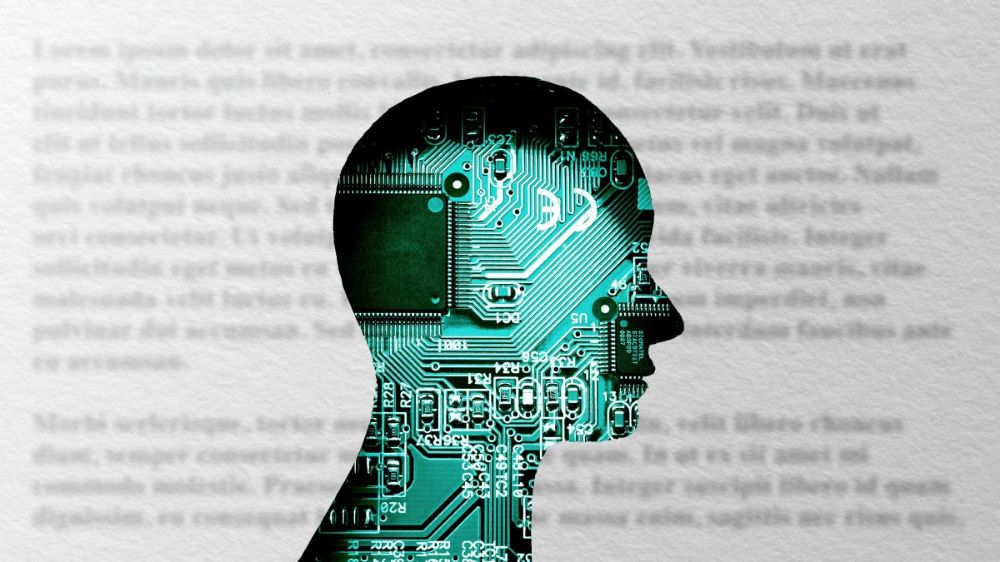

# تولید شعر با شبکه عصبی LSTM و تنسورفلو

یادگیری عمیق ابزاری فوق العاده برای ساخت پروژه های مهیج و سرگرم‌کننده است، هر روز خبری در مورد کاربرد های جدید یادگیری عمیق منتشر میشود و همگان را در تعجب فرو میبرد، آموزش این مدل های جذاب هم در نوع خودش سرگرم‌کننده است مخصوصا مدل های مرتبط به پردازش زبان طبیعی(NLP).

در این ویرگول میخواهم نشان بدهم چگونه میتوان از یادگیری عمیق برای تولید شعر استفاده کنیم، مدلی که خواهیم ساخت، ارتباط بین کارکتر ها را متوجه میشود و احتمال وقوع کارکتر بعدی را محاسبه میکند.

>در این پروژه از شبکه عصبی LSTM استفاده خواهیم کرد. به طور خلاصه، LSTM یک نوع خاص از یک شبکه عصبی RNN است که در پردازش داده هایی که دارای توالی منظم و مرتبط هستند استفاده میشود. مثل متون، موسیقی ها، ویدئو ها و...

>تفاوت RNN ها با شبکه های عصبی کلاسیک داشتن وابستگی زمانی یا اثر حافظه است که داده های قبلی را در حافظه به خاطر میسپارد تا در تصمیم گیری های بعدی استفاده کند.
>برای مطالعه بیشتر[camelCase](https://colah.github.io/posts/2015-08-Understanding-LSTMs/)
